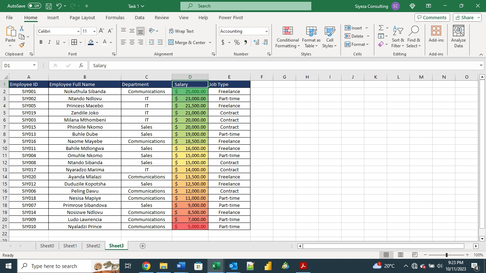

# Data-Analysis-Tasks-Week_1

## EXCEL TASK 1

**We were tasked with producing a worksheet that includes 20 rows of data, featuring fields for Employee ID, Employee's Full Name, Department, Salary, and Job Type**.
- - -
I generated a table listing the names of both family members and friends. Employee IDs, salaries, and job types were assigned using a random system. To enhance dataset readability, I applied background colors to the column headers and included borders around the data set. Subsequently, the dataset was duplicated onto Sheets 2 and 3 due to additional tasks requiring the same data.

- - -

**In the first sheet, our task was to display employees designated as "Freelancers" and highlight those whose salaries exceed $10,000**.

To achieve this, I began by choosing the Job Type column and activating the filter option. I then filtered the list to retain only the "Freelancers." Next, I applied conditional formatting to the salary column to highlight salaries exceeding $10,000, utilizing a custom color for this purpose.

- - -

**In the second sheet, our objective was to separate the employees' Full Name into their First Name and Last Name, and subsequently identify and highlight any duplicate entries**.

To accomplish this, I utilized the "Text to Columns" feature found on the Excel Data tab. I began by adding an additional column adjacent to the Employee Name column. Afterward, I selected the Employee Name column and initiated the "Text to Columns" option. The data type "Delimited" was already chosen, and I proceeded to the next step. I designated a space as the delimiter and proceeded to the next step once more, with the data type already set to "General" and the destination column set to the current column. Finally, I clicked "Finish" and confirmed my choice to replace data in the column when prompted. As a result, the first and last names were separated into their respective columns. Subsequently, I checked for duplicates in both the First Name and Last Name columns, and none were found.

- - -

**On the third sheet, our task was to mark employees whose names started with the letter "E" in yellow. Additionally, we were required to format the salary column so that the highest salary was displayed with a green background, and the lowest salary was presented with a red background**.

I began by choosing the column containing employee names. I then accessed conditional formatting, selected "Cell Rules," and opted for "More Rules." Subsequently, I customized the rule to target cells with text beginning with "E" and applied a yellow format. However, no such cells were identified. Afterward, I sorted the salary column in descending order, arranging it from the highest to the lowest values. To represent the salary range, I utilized a green-yellow-red color scale through conditional formatting.

- - -

## EXCEL TASK 2

**For this task we were provided with a Company’s financial data set. The data set contained 16 columns and 700 rows with information**.

The dataset was already cleaned, requiring just a few data management steps. Initially, I adjusted the column sizes to accommodate their respective contents. Following that, I applied color to the header columns and centered the content to enhance readability. Furthermore, I refined the data types of the columns, converting those pertaining to monetary values to currency, dates to date format, and text columns to text data types, while leaving the remaining data as general.
- - -

**The first task was to determine the total revenue and profit generated**.

To calculate the overall revenue, I utilized the SUM function to add up the values in the entire sales column. 

Similarly, for the total profit, I summed the figures within the profit column, once again employing the SUM function. 

As a result, it was determined that the Total Revenue amounted to $118,726,350.26, and the Total Profit stood at $16,893,702.26.
- - -

**The second task was to determine the average revenue and units sold for every order**.

For this task, I used the AVERAGE function on the sales column.

I also used the AVERAGE function on the units sold column.

Consequently, it was ascertained that the average revenue amounted to $169,609.07, while the average units sold equated to 1608.
- - -

**The third task was to find the total discount given in $**.

I used the SUM function on the discount column to solve this problem.

Total discount is $9,205,248.24
- - -

**The fourth task was to get the total number of sales recorded**.

I used the COUNT function on the Units Sold column  to determine the number of transactions that had been recorded.

- - -

**The fifth task was to determine the highest profit generated**.

I used the MAX function on the profit column.

Highest profit is $262,200.00
- - -

**The last task involved creating a new column called "Sales Range," which would display "High Sales" if the sales value exceeded the average, or "Low Sales" if it fell below the average**.

I added a new column and labeled it "Sales Range." I used the IF function to determine the sales range based on the values in the Sales column, while also utilizing absolute referencing for the cell containing the average sale value.

- - -

